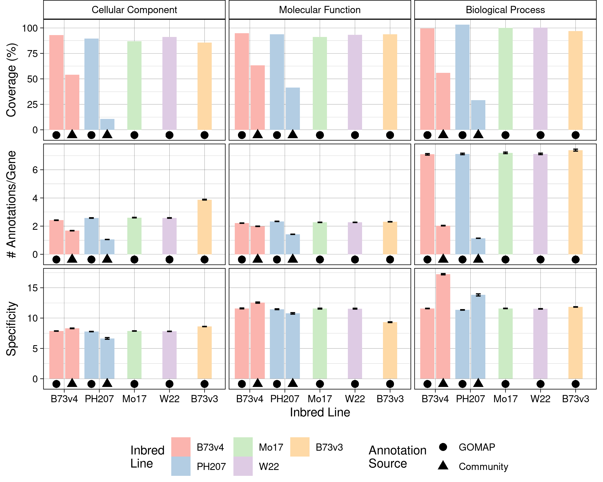
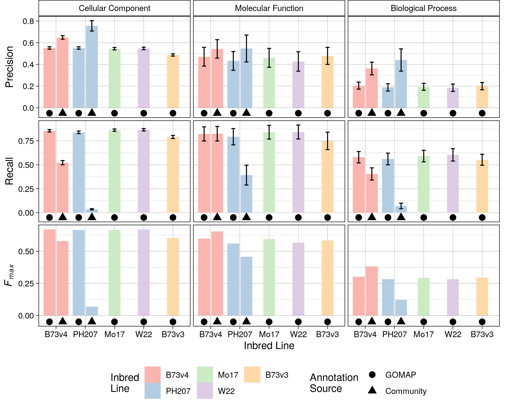

# Figures

## Long-read sequencing datasets published for plants in the NCBI Short Read Archive.

* Top histogram: number of studies or experiments 2012-2019. 
* Bottom: number of runs deposited for the same time period (each study is made up of one or more runs).
* *NCBI SRA was queried on Jan 30, 2021 with the following parameters: (("pacbio smrt"[Platform]) OR "oxford nanopore"[Platform]) AND Embryophyta[Organism] AND wgs[strategy])*

## Overview of processes used to create GOMAP Annotations

Top: data inputs are shown as a white box. Sequence similarity components are shown in lime green. InterProScan domain-based annotations are shown in orange. For the CAFA processes (Argot2.5 and PANNZER; shown in tan boxes) pre-processing steps are shown in purple and blue, respectively. The CAFA process FANN-GO does not require preprocessing (red). Once each annotation type is produced, these are combined, duplicates and redundancies are removed, and the aggregate dataset is assembled (turquoise). 

## Comparison of runtime for GOMAP steps across four  maize genomes.

Steps are color-coded as shown in the figure key at right. Start time occurs at zero.  The four steps shown simultaneously within a single maize genome (i.e., seqsim, domain, mixmeth-blast, and fanngo) run in parallel. For all maize genomes, the full annotation time took less than 24 hours on the PSC Bridges cluster.

## Analysis metrics calculated for the maize annotations from community and GOMAP annotations.

  Left column: Cellular Component.  Middle column: Molecular Function. Right column: Biological Process. Top row: Percentage of genes with an annotation. Middle row: number of annotations per gene. Bottom row: specificity of the annotations. Inbred lines are color-coded as shown in the key at bottom.  GOMAP annotations are denoted by a filled circle.  Community annotations are denoted by a filled triangle. Coverage is shown as an overall percentage, but both number of annotation per gene and specificity are represented as mean values across all annotations in the dataset. Error bars indicate standard error. The confidence interval is very small so the high and low error bars overlap each other for most datasets. 

## Evaluation metrics calculated for the maize annotations from the community and GOMAP.

## Comparison of the GOMAP and community annotations based on whether gold standard terms were annotated.

Left column: Cellular Component.  Middle column: Molecular Function. Right column: Biological Process. Top row: Percentage of genes with at least one annotation. Middle row: proportion of terms recovered. Bottom row: XXX. Gold standard genes or annotations recovered by both the community and GOMAP methods are shown in pink. Those recovered by GOMAP but not the community method are shown in blue. Those recovered by the community annotation but not GOMAP are shown in green. Those annotated in the gold-standard that were not recovered by either method are shown in lavender. 
